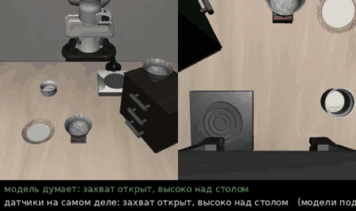
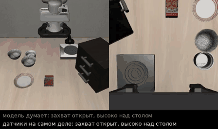

# Открытая проблема в мультимодальных моделях сенсомоторной координации для манипуляции

> Тестовое задание: анализ свежих работ (2021–2026), формулировка открытой
> исследовательской проблемы и гипотезы для её преодоления, подкреплённые
> воспроизведением пайплайнов.

**Направление:** мультимодальные модели сенсомоторной координации для управления манипуляцией
(Vision-Language-Action модели, диффузионные политики, политики с тактильным/силовым входом).

---

## Коротко

- **Проблема:** нынешние VLA-модели обучены в большей части на данных с камеры, без данных датчиков,
  а данные с датчиками сейчас собирают только на живом роботе — каждая лаборатория на своём.
- **Гипотеза:** перчатка — конечный эффектор с датчиками, в которой человек собирает данные без робота,
  а потом её крепят к нужному роботу. Если сделать её открытым стандартом, данные с датчиками из разных
  лабораторий можно будет объединять.
- **Ключевой результат воспроизведения:** OpenVLA-OFT, которую с самого начала учили с датчиками, без них
  ломается (30/30 → 2/30), а Octo, получившая датчики только при дообучении, их почти не замечает (20/30 и с
  живыми, и с замороженными датчиками).

## Главы

| Глава | О чём |
|-------|-------|
| [Глава 1. OpenVLA: что модель видит и чего не чувствует](chapter1/README.md) | разбор OpenVLA и связанных работ, данные BridgeData V2, кинематика WidowX |
| [Глава 2. OpenVLA-OFT: быстрее, точнее и с новыми «органами чувств»](chapter2/README.md) | рецепт дообучения OFT: параллельная генерация, пачки действий, камера на запястье и состояние робота |
| [Глава 3. Octo и FuSe: как научить модель пользоваться датчиками](chapter3/README.md) | Octo в LIBERO, своё дообучение с датчиками и без, упрощённый FuSe, что модель «думает» на каждом шаге |
| [Глава 4. ForceVLA: сила как отдельный «эксперт»](chapter4/README.md) | разбор ForceVLA: откуда берётся сила, смесь экспертов, результаты и почему не повторить в симуляторе |
| [Глава 5. Подведение итогов](chapter5/README.md) | общие проблемы, риски, гипотезы и продолжение работы |

## Проблема

Нынешние VLA-модели обучены в большей части на данных с камеры, без данных датчиков. Чтобы дообучить уже
работающую модель пользоваться датчиками, нужна разработка дополнительных методов — так поступили авторы
FuSe и ForceVLA, — поскольку огромное количество данных собирается с помощью живого робота: человек управляет
им через очки виртуальной реальности, и каждая лаборатория собирает свой небольшой набор на своём роботе.

В главе 2 я думал отказаться от этой мысли: для дообучения OpenVLA-OFT хватало от 20 до 300 демонстраций на
задачу, и узким местом выглядела скорее вычислительная мощность
([глава 2, раздел 3.3](chapter2/README.md#33-что-это-значит-для-моей-гипотезы-из-главы-1)). Но главы 3–5
показали, что дело не в числе демонстраций для одной задачи, а в том, что больших наборов данных с датчиками
нет. Поэтому мне кажется важным эту проблему сформулировать и обсудить.

Что это подтверждает (подробнее — [глава 5, раздел 1](chapter5/README.md#1-нет-больших-наборов-данных-с-датчиками)):
- **FuSe** прямо пишет, что модели, которые в принципе умеют принимать разные входы, на деле ограничены в
  основном картинками — из-за нехватки наборов данных с другими датчиками. Чтобы это обойти, авторы сами
  собрали около 27 тысяч демонстраций с осязанием и звуком, управляя роботом через очки Meta Quest 2.
- **ForceVLA** собрала 244 демонстрации на одном роботе Flexiv. Если просто подать силу на вход π0, выигрыш
  почти нулевой (37,3% → 40,2%); помог только отдельный блок экспертов. И сила у них — оценка именно этого
  робота: на другом её придётся получать заново.
- **Глава 2:** OpenVLA-OFT, которую учили с датчиками с самого начала, на них опирается: если «заморозить»
  датчики, успех падает с 30/30 до 2/30.
- **Глава 3:** Octo, которой я добавил датчики только при дообучении, их почти не замечает, а состояние
  захвата узнаёт по камере. Пустой захват она распознаёт лишь в 2% случаев.

## Гипотеза: перчатка — конечный эффектор как открытый стандарт

Создать перчатку — конечный эффектор, которая не нуждается в живом роботе: оператор выполняет задачу в ней
сам, а потом она крепится к нужному роботу и выдаёт те же показания датчиков, что и при обучении. Если сделать
этот проект open source и воспроизводимым в разных лабораториях, то есть сделать из этой «руки» стандарт — как
это сделано с обучающими роботами, на которых впоследствии учат модели (например, WidowX в BridgeData V2 из
главы 1), — данные с датчиками из разных лабораторий можно будет объединять в один большой набор.

Основная гипотеза: если мы можем сделать такую перчатку, то оператор, помимо того что увеличит скорость сбора
и разнообразие данных, сможет выполнять более сложные задачи привычным для себя способом. Например, как в
ForceVLA (глава 4), где робота учили чистить огурец: в перчатке человек сам возьмёт в руки овощечистку, а в
статье этот момент вообще не показан — на кадрах робот уже держит её
([глава 4, раздел 2](chapter4/README.md#2-практика)).

Датчики при этом должны стоять в самой перчатке (на пальцах или на запястье), а не вычисляться по моторам
конкретного робота, как в ForceVLA, — тогда их показания не зависят от того, к какому роботу перчатку
прикрепили.

Впервые эта идея появилась у меня в [главе 1](chapter1/README.md#33-гипотеза-ручной-захват-с-известным-положением) —
тогда ради скорости сбора данных. Теперь главная причина другая — данные с датчиками.

**Что уже есть и чем это отличается.** Ручные захваты для сбора данных без робота уже существуют:
- **UMI** (Chi и др., RSS 2024, [arXiv:2402.10329](https://arxiv.org/abs/2402.10329)) — ручной захват с
  камерой; такой же захват ставится на робота, код и чертежи открыты;
- **UMI-FT** ([arXiv:2601.09988](https://arxiv.org/abs/2601.09988)) — тот же захват с 6-осевым датчиком силы
  на каждом пальце;
- **FARM** ([arXiv:2510.13324](https://arxiv.org/abs/2510.13324)) — захват UMI с тактильным датчиком GelSight.

То есть сама «рука» без робота не нова. Новое, что я предлагаю, — сделать стандартом именно набор датчиков,
чтобы собрать из разных лабораторий большой набор данных с силой и осязанием и учить VLA с датчиками с самого
начала, а не добавлять их при дообучении на сотне демонстраций. Насколько я понял, пока каждое такое
устройство используется одной лабораторией для своих задач.

## Ключевой результат воспроизведения

Подробно — в разделах «Что я сделал» глав [1](chapter1/README.md#2-что-я-сделал),
[2](chapter2/README.md#2-что-я-сделал) и [3](chapter3/README.md#2-что-сделал). Все модели проверялись в
симуляторе LIBERO (набор LIBERO-Spatial) на одних и тех же 30 попытках: 10 задач × 3 начальные расстановки.

| Модель | Входы | Успех |
|---|---|---|
| OpenVLA (глава 1) | внешняя камера | 23/30 |
| OpenVLA-OFT (глава 2) | 2 камеры + датчики | **30/30** |
| OpenVLA-OFT, датчики заморожены | 2 камеры + датчики с первого шага | **2/30** |
| Octo (глава 3) | внешняя камера | 22/30 |
| Octo, моё дообучение с датчиками | внешняя камера + датчики | 20/30 |
| то же, датчики заморожены | внешняя камера + датчики с первого шага | 20/30 |
| Octo, упрощённый FuSe | внешняя камера + датчики | 17/30 (при повторном прогоне 20/30) |
| то же, датчики заморожены | внешняя камера + датчики с первого шага | 20/30 |

«Заморожены» — модель всё время получает показания датчиков с первого шага попытки, как будто датчик завис.

Полноценно воплотить в жизнь идею того, что датчики дают лучшие результаты, в симуляторе не получилось:
добавленные при дообучении датчики Octo не помогли, и даже упрощённый FuSe не заставил модель на них
опираться — состояние захвата она узнаёт по камере. Но статьи показывают, что модель начинает пользоваться
датчиком, когда данных с ним много и он есть в обучении с самого начала: FuSe для этого собрала около
27 тысяч демонстраций, а OpenVLA-OFT без датчиков ломается (30/30 → 2/30).

<table>
<tr>
<td align="center"><br><i>датчики заморожены, а модель всё равно верно описывает захват — по камере</i></td>
<td align="center"><br><i>пальцы сжаты впустую, а модель считает, что держит миску (красное)</i></td>
</tr>
</table>
<p align="center"><i>Глава 3, упрощённый FuSe: «модель думает» — описание состояния захвата от модели,
«датчики на самом деле» — то же описание по живым показаниям датчиков.</i></p>

## Структура репозитория

```
.
├── README.md        # главная страница: проблема, гипотеза, результаты
├── chapter1/ … chapter5/   # главы: что прочитал, что сделал, мысли (картинки и GIF — в images/)
├── notebooks/       # Colab-ноутбуки главы 3 (Octo)
├── scripts/         # скрипты запуска моделей, дообучения и анализа
└── results/         # таблицы по каждой попытке (csv, json)
```

## Как запустить

Все опыты запускались в Google Colab. Ссылки на ноутбуки — в разделе «Что я сделал» каждой главы:
[глава 1](chapter1/README.md#2-что-я-сделал) (OpenVLA), [глава 2](chapter2/README.md#2-что-я-сделал)
(OpenVLA-OFT), [глава 3](chapter3/README.md#2-что-сделал) (Octo, дообучение и упрощённый FuSe).

## Использование ИИ-инструментов

- Поиск статей по ключевым словам и проблемам производился через Gemini Deep Research.
- Детальный разбор статей производился с помощью Gemini.
- Основное оформление репозитория и воплощение экспериментов производились через Claude (Claude Code).
