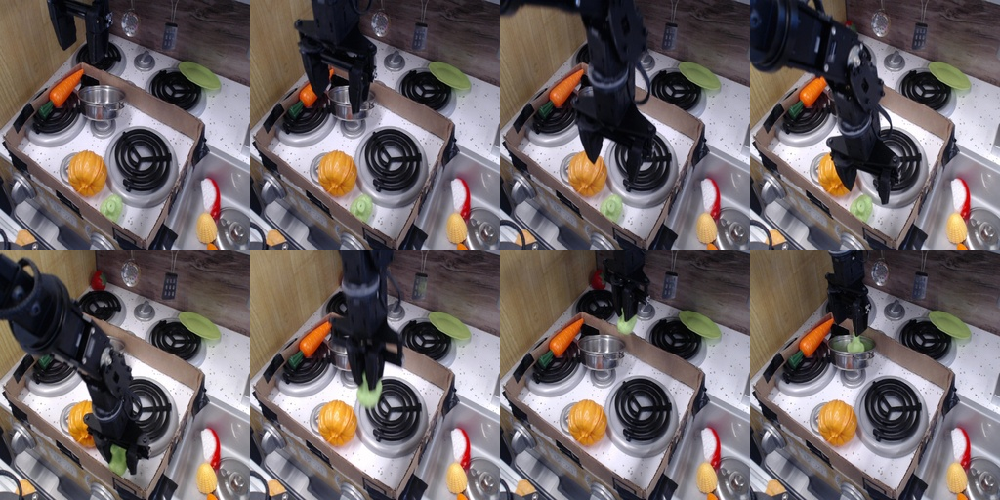

# Глава 1. OpenVLA: что модель видит и чего не чувствует

> **Черновик.** Заметки ниже собраны по ходу разбора статей — их нужно переписать
> своими словами и дополнить. Ссылки вида «§3.3» ведут на разделы статьи OpenVLA.

**Статья:** Kim, Pertsch, Karamcheti и др. *OpenVLA: An Open-Source Vision-Language-Action Model*, 2024.
[arXiv 2406.09246](https://arxiv.org/abs/2406.09246) · [сайт](https://openvla.github.io/) ·
[код](https://github.com/openvla/openvla) · [веса](https://huggingface.co/openvla/openvla-7b)

## Введение

Ранее опыта в теме данного обзора у меня не было, поэтому я хочу начать со знакомства
с тематикой. Для этого я выбрал статью 2024 года об OpenVLA, которая описывает метод,
благодаря которому происходит «магия»: роботу простыми словами говорят, что нужно сделать,
и он это делает без заранее подготовленной траектории.

## Содержание

1. [Что я прочитал](#1-что-я-прочитал)
2. [Что я сделал](#2-что-я-сделал)
3. [Мои мысли](#3-мои-мысли)
4. [Источники](#4-источники)

---

## 1. Что я прочитал

### 1.1. Основной смысл метода VLA

Есть хорошо развитая отрасль VLM (vision-language model), где цель — понять, что изображено
на картинке. Смысл VLA (vision-language-action) в том, чтобы взять VLM и принцип угадывания
следующего токена, как это реализовано в ChatGPT, но обучать модель на данных с робота.
Так мы учим систему решать нужные нам задачи.

### 1.2. Цель статьи

Статья OpenVLA ставит перед собой цель помочь науке развиваться в этой отрасли: проект
сделан открытым (open source), а технология оптимизирована для разных целей. Готовую модель
можно дообучить, чтобы решить более узкую задачу или работать с другим роботом, либо
сделать на её основе свою модель.

### 1.3. Принцип работы OpenVLA

Берётся подготовленный массив данных, где человек выполняет работу с помощью робота:
передвигает объекты, описывает свою задачу словами, а данные робота записываются. Далее на
основе этих данных обучается модель. Теперь она способна предсказывать, что бы сделал
человек, и сама начинает двигать робота, как на тестовых видео.

Для работы используется одна камера, которая видит и робота, и рабочее пространство.
На вход подаётся изображение и то, что мы хотим, чтобы произошло («убери красный мяч
в коробку»). На выходе получаем 7 значений: насколько нужно сдвинуть target frame по осям
x, y, z, насколько его повернуть, а также что сейчас делать с end effector (open/close).
И так несколько раз в секунду.

<b>Технические подробности</b>

- **Состав:** визуальные энкодеры SigLIP + DINOv2 → проектор → языковая модель Llama 2 7B.
- **Действия как «слова»:** каждое из 7 чисел разбито на 256 уровней (по 1-му и 99-му
  процентилю данных), уровням соответствуют 256 редко используемых токенов Llama;
  обучение — предсказание следующего токена, ошибка считается только на токенах действия.
- **Данные:** 970 тыс. записей из Open X-Embodiment; 64 × A100, 15 дней.
- **Частота:** 5–15 Гц; модель не видит историю кадров и состояние робота.

### 1.4. Решения, принятые авторами (§3.4)

| Решение | Что выяснили | Почему это важно для меня |
|---|---|---|
| Основа модели | Prismatic лучше LLaVA (~+10%), LLaVA лучше IDEFICS (+35%) | лучшее пространственное зрение = лучше управление |
| Разрешение | 224 и 384 px не отличаются, 384 учится в 3 раза дольше | вопрос: хватит ли 224 px для точных задач? |
| Энкодер зрения | замораживать нельзя — готовое «зрение» не видит мелких деталей | зрение для манипуляции приходится переучивать |
| Эпохи | 27 проходов по данным, пока точность токенов > 95% | модель заучивает данные → проверять только на val |

### 1.5. Что авторы сознательно оставили за рамками (§3.3, сноска 2)

В обучение вошли только датасеты с внешней камерой и управлением позой захвата одной руки.
Обучение на разнородных сенсорах и пространствах действий авторы прямо откладывают на будущее,
ссылаясь на Octo как на работу, где это уже пробовали.

### 1.6. Где модель проигрывает (по сайту и статье)

- Узкие точные задачи (пересыпать, положить точно): Diffusion Policy с нуля лучше.
- Понятия из интернета («подвинь к Тейлор Свифт»): RT-2-X лучше — OpenVLA дообучали
  только на данных роботов.
- Скорость: 5–15 Гц, действие генерируется по одному токену.

### 1.7. Связанные работы, к которым ведёт эта статья

| Работа | Что добавляет | Что осталось |
|---|---|---|
| Octo (2024) | новые входы при дообучении; датчик силы во вставке штыря: 70% против 10% с нуля | камера на запястье и состояние робота часто **ухудшают** результат (causal confusion) |
| π0 (2024) | 2–3 камеры + суставы при основном обучении, 50 шагов вперёд, до 50 Гц | силы и касания нет |
| OpenVLA-OFT (2025) | вторая камера и суставы через отдельный проектор, непрерывные действия, в 26 раз быстрее | только при дообучении; силы нет |
| ForceVLA (2025) | 6-осевая сила/момент к π0, +23,2% на задачах с контактом | свой датасет на 5 задач |

<!-- TODO: добавить TaF-VLA, FD-VLA после прочтения -->

---

## 2. Что я сделал

<!-- TODO: дополнять по мере работы -->

### 2.1. Данные для проверки: BridgeData V2 (val)

- Нашёл, что OpenVLA обучалась на train-части BridgeData V2 (53 192 записи), а val-часть
  (6 872 записи) отделена — её и берём для честной проверки.
- Написал скрипт `scripts/extract_bridge_episode.py`, который скачивает один файл val
  (~130 МБ, 54 записи) и выгружает запись: кадры, видео и таблицу поз/действий.
- Разобрал запись «put broccoli in pot» (38 шагов, 5 Гц): `examples/bridge_val000_ep34/`.

<!-- Картинки появятся после слияния ветки data/bridge-episode-extractor -->

**Наблюдения по данным:**
- Действие опережает изменение позы примерно на шаг.
- При захвате брокколи захват остановился на ~0,23 вместо 0 — это сигнал «предмет в руке»,
  который записан в данных, но **не подаётся** в OpenVLA.
- В 10 из 54 записей нет текстовой команды, некоторые команды бессмысленны.

### 2.2. Кинематика робота WidowX 250 6DOF

- Пересчитал модель производителя (винтовые оси Interbotix) в DH-параметры и проверил
  совпадение на 10 000 случайных поз (расхождение ~10⁻¹⁴ м): `docs/robot_widowx250s.md`.
- Сравнил с FANUC LR Mate 200iD: похожая кинематика и досягаемость, но точность WidowX
  5–8 мм против сотых долей миллиметра у промышленного робота.

### 2.3. Прогон OpenVLA на записях BridgeData

<!-- TODO: Colab-ноутбук, таблица «человек vs модель», графики, видео из ROBOGUIDE -->

---

## 3. Мои мысли

<!-- TODO: это самая важная часть главы — писать своими словами -->

**Вопросы, которые возникли при чтении:**

- Модель только *видит*, но не *чувствует*. Как она поймёт, что предмет выскальзывает,
  если это не видно на камере?
- Почему добавление камеры на запястье и состояния робота в Octo часто ухудшает результат,
  а в π0 и OFT — помогает? В чём разница?
- Зрение модели учат на сотнях тысяч записей, а силу — каждый раз заново на 100 демонстрациях
  конкретного робота. Можно ли учить «осязание» так же масштабно?
- Промышленные роботы (FANUC) не имеют камеры на запястье, но контроллер всегда знает токи
  моторов и оценку внешнего момента по осям. Подходит ли это как «бесплатный» датчик силы?

**Идея эксперимента:**

- Проверить на данных BridgeData, насколько раскрытие захвата (одно число) помогает понять,
  взят ли предмет, — по сравнению с тем, что видно на картинке.

---

## 4. Источники

- Kim et al. *OpenVLA: An Open-Source Vision-Language-Action Model*, 2024. [arXiv 2406.09246](https://arxiv.org/abs/2406.09246)
- Octo Model Team. *Octo: An Open-Source Generalist Robot Policy*, 2024. [arXiv 2405.12213](https://arxiv.org/abs/2405.12213)
- Black et al. *π0: A Vision-Language-Action Flow Model for General Robot Control*, 2024. [arXiv 2410.24164](https://arxiv.org/abs/2410.24164)
- Kim, Finn, Liang. *Fine-Tuning Vision-Language-Action Models: Optimizing Speed and Success* (OpenVLA-OFT), 2025. [arXiv 2502.19645](https://arxiv.org/abs/2502.19645)
- *ForceVLA: Enhancing VLA Models with a Force-aware MoE for Contact-rich Manipulation*, NeurIPS 2025. [arXiv 2505.22159](https://arxiv.org/abs/2505.22159)
- Walke et al. *BridgeData V2: A Dataset for Robot Learning at Scale*, 2023. [сайт](https://rail-berkeley.github.io/bridgedata/)
