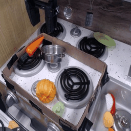
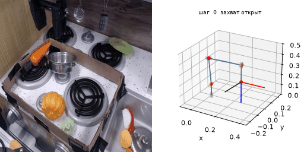
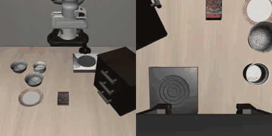
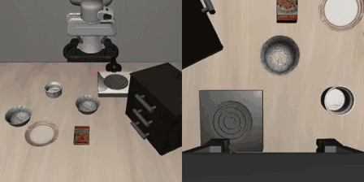
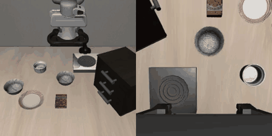
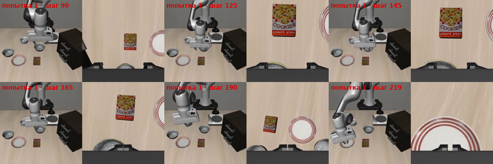
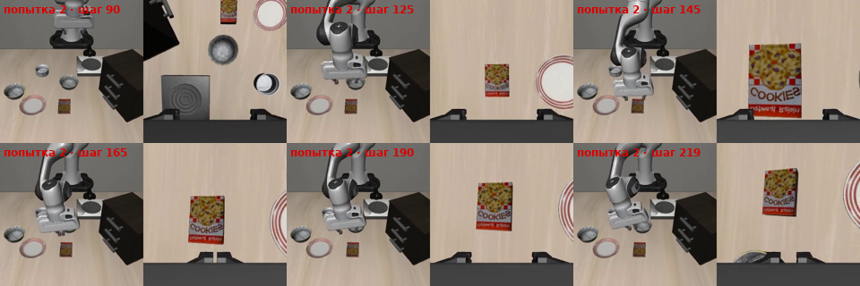
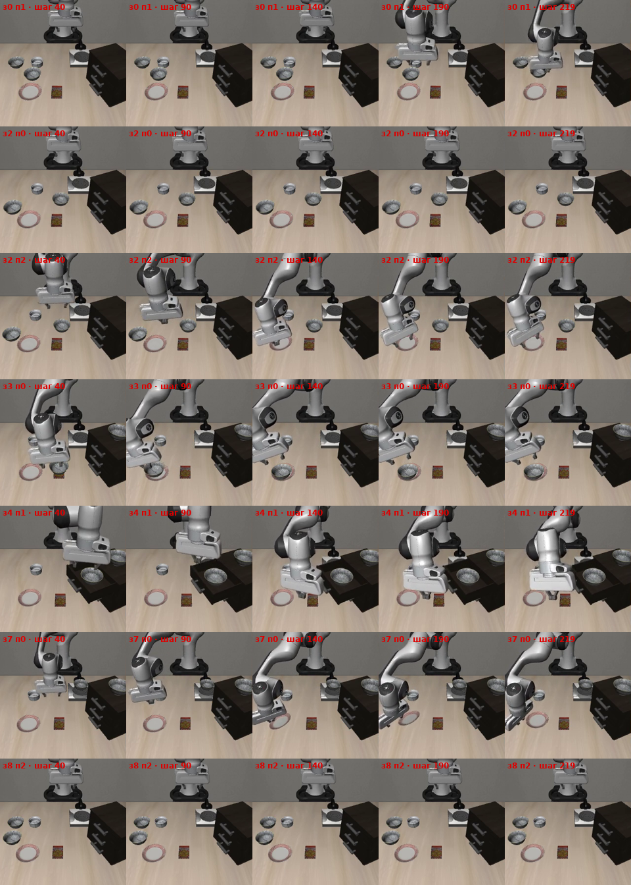
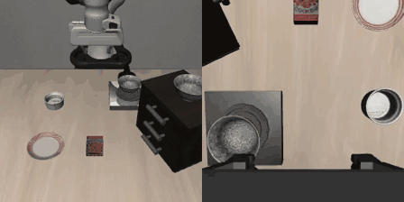
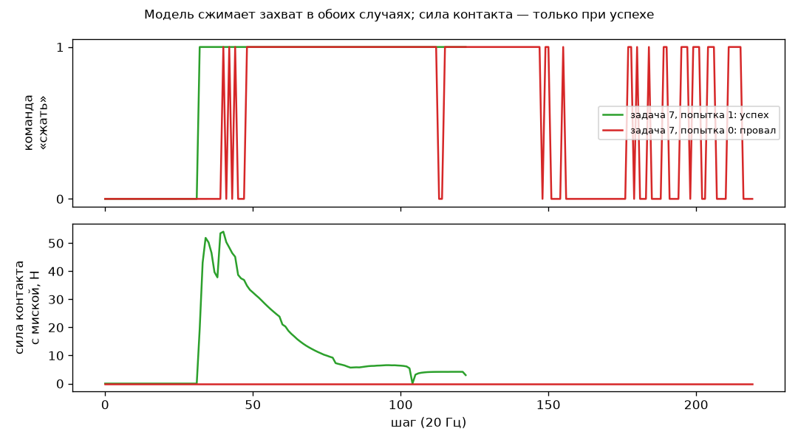

# Глава 1. OpenVLA: что модель видит и чего не чувствует

> **Черновик.** Заметки ниже собраны по ходу разбора статей — их нужно переписать
> своими словами и дополнить. Ссылки вида «§3.3» ведут на разделы статьи OpenVLA.

**Статья:** Kim, Pertsch, Karamcheti и др. *OpenVLA: An Open-Source Vision-Language-Action Model*, 2024.
[arXiv 2406.09246](https://arxiv.org/abs/2406.09246) · [сайт](https://openvla.github.io/) ·
[код](https://github.com/openvla/openvla) · [веса](https://huggingface.co/openvla/openvla-7b)

## Введение

Ранее опыта в теме данного обзора у меня не было, поэтому я хочу начать со знакомства
с тематикой. Для этого я выбрал статью 2024 года об OpenVLA, которая описывает метод,
благодаря которому происходит «магия»: роботу простыми словами говорят, что нужно сделать,
и он это делает без заранее подготовленной траектории.

## Содержание

1. [Что я прочитал](#1-что-я-прочитал)
2. [Что я сделал](#2-что-я-сделал)
3. [Впечатления и идеи после статьи](#3-впечатления-и-идеи-после-статьи)
4. [Источники](#4-источники)

---

## 1. Что я прочитал

### 1.1. Основной смысл метода VLA

Есть хорошо развитая отрасль VLM (vision-language model), где цель — понять, что изображено
на картинке. Смысл VLA (vision-language-action) в том, чтобы взять VLM и принцип угадывания
следующего токена, как это реализовано в ChatGPT, но обучать модель на данных с робота.
Так мы учим систему решать нужные нам задачи.

### 1.2. Цель статьи

Статья OpenVLA ставит перед собой цель помочь науке развиваться в этой отрасли: проект
сделан открытым (open source), а технология оптимизирована для разных целей. Готовую модель
можно дообучить, чтобы решить более узкую задачу или работать с другим роботом, либо
сделать на её основе свою модель.

### 1.3. Принцип работы OpenVLA

Берётся подготовленный массив данных, где человек выполняет работу с помощью робота:
передвигает объекты, описывает свою задачу словами, а данные робота записываются. Далее на
основе этих данных обучается модель. Теперь она способна предсказывать, что бы сделал
человек, и сама начинает двигать робота, как на тестовых видео.

Для работы используется одна камера, которая видит и робота, и рабочее пространство.
На вход подаётся изображение и то, что мы хотим, чтобы произошло («убери красный мяч
в коробку»). На выходе получаем 7 значений: насколько нужно сдвинуть target frame по осям
x, y, z, насколько его повернуть, а также что сейчас делать с end effector (open/close).
И так несколько раз в секунду.

<b>Технические подробности</b>

- **Состав:** визуальные энкодеры SigLIP + DINOv2 → проектор → языковая модель Llama 2 7B.
- **Действия как «слова»:** каждое из 7 чисел разбито на 256 уровней (по 1-му и 99-му
  процентилю данных), уровням соответствуют 256 редко используемых токенов Llama;
  обучение — предсказание следующего токена, ошибка считается только на токенах действия.
- **Данные:** 970 тыс. записей из Open X-Embodiment; 64 × A100, 15 дней.
- **Частота:** 5–15 Гц; модель не видит историю кадров и состояние робота.

### 1.4. Решения, принятые авторами (§3.4)

| Решение | Что выяснили | Почему это важно для меня |
|---|---|---|
| Основа модели | Prismatic лучше LLaVA (~+10%), LLaVA лучше IDEFICS (+35%) | лучшее пространственное зрение = лучше управление |
| Разрешение | 224 и 384 px не отличаются, 384 учится в 3 раза дольше | вопрос: хватит ли 224 px для точных задач? |
| Энкодер зрения | замораживать нельзя — готовое «зрение» не видит мелких деталей | зрение для манипуляции приходится переучивать |
| Эпохи | 27 проходов по данным, пока точность токенов > 95% | модель заучивает данные → проверять только на val |

### 1.5. Что авторы сознательно оставили за рамками (§3.3, сноска 2)

В обучение вошли только датасеты с внешней камерой и управлением позой захвата одной руки.
Обучение на разнородных сенсорах и пространствах действий авторы прямо откладывают на будущее,
ссылаясь на Octo как на работу, где это уже пробовали.

### 1.6. Где модель проигрывает (по сайту и статье)

- Узкие точные задачи (пересыпать, положить точно): Diffusion Policy с нуля лучше.
- Понятия из интернета («подвинь к Тейлор Свифт»): RT-2-X лучше — OpenVLA дообучали
  только на данных роботов.
- Скорость: 5–15 Гц, действие генерируется по одному токену.

---

## 2. Что я сделал

### 2.1. Первая мысль: ROBOGUIDE и записи из датасета

Первая идея, как можно было бы протестировать OpenVLA, была связана с моим предыдущим опытом
работы и доступом к ROBOGUIDE и солверам робота. Моей задачей было просто посмотреть, как будет
работать робот и будет ли он реагировать на мои команды.

Делал бы я это так: взял бы видео из датасета, на котором обучалась модель, — например, эту запись
«put broccoli in pot» из BridgeData V2 (38 кадров, 5 кадров/с):

Поскольку в датасете записано положение робота в формате «положение + ориентация» захвата,
с помощью обратной кинематики и солвера можно получить значения моторов, а по ним построить
визуализацию того, как робот движется по траектории:

<i>Слева — кадр камеры из датасета, справа — кинематическая модель WidowX 250 6DOF
(DH-параметры, библиотека visual-kinematics), которая проходит записанную траекторию через обратную
кинематику. Оранжевая линия — путь захвата.</i>

Дальше я бы подал это видео в OpenVLA и, как я ошибочно ожидал, получил бы по видео целую
траекторию, которую тоже провёл бы через солвер и сравнил по точности с исходной. Но работа и метод
VLA не об этом: мы работаем с обратной связью и должны обрабатывать изображение и положение робота
каждый раз, когда он сдвинулся.

<b>Что для этого было подготовлено</b>

- **Данные.** OpenVLA обучалась на train-части BridgeData V2 (53 192 записи); val-часть
  (6 872 записи) отделена. Скрипт `scripts/extract_bridge_episode.py` скачивает один файл val
  (~130 МБ, 54 записи) и выгружает запись: кадры, видео и таблицу поз и действий оператора.
- **Кинематика WidowX 250 6DOF.** Модель производителя (винтовые оси Interbotix) пересчитана в
  DH-параметры; прямая кинематика совпадает с моделью производителя на 10 000 случайных поз
  (расхождение ~10⁻¹⁴ м) — `docs/robot_widowx250s.md`.
- **Система координат BridgeData** (по коду робота Беркли `bridge_data_robot`): позиция — прямая
  кинематика Interbotix в системе основания; углы — от R_ee · DEFAULT_ROTATIONᵀ, где R = Rz·Ry·Rx,
  а `DEFAULT_ROTATION` соответствует захвату пальцами вниз. С этим соглашением все 38 поз записи
  достижимы в пределах суставов, суставы меняются не больше чем на 15° за шаг, а пальцы во всех
  позах смотрят вниз — как на видео. Скрипт: `scripts/bridge_replay_animation.py`.
- **Наблюдение по данным.** При захвате брокколи пальцы остановились на ~0,23 вместо 0 — это
  сигнал «предмет в руке», который записан в данных, но не подаётся в OpenVLA.

### 2.2. Переход в симуляцию LIBERO

После изучения приложения к статье (Приложение E) я увидел пример того, как OpenVLA используют
в симуляторе LIBERO. Он «понимает», что происходит с объектами, и сам определяет, выполнена ли
задача, — так эксперимент можно автоматизировать. Поскольку я впервые столкнулся с этим
симулятором, я попробовал реализовать свою задумку с помощью Claude: всё установить в Google Colab
и запустить модель.

Используется не базовая OpenVLA, а **`openvla-7b-finetuned-libero-spatial`** — версия, которую
авторы дообучили (LoRA, r = 32) специально под набор задач LIBERO-Spatial: 10 задач вида
«возьми чёрную миску … и поставь на тарелку», около 50 демонстраций человека на задачу (из 500
демонстраций авторы убрали 68 неудачных), только внешняя камера — без камеры на запястье.
Авторы сообщают для неё 84,7% успешных выполнений (Таблица 12). У меня она запущена в 4-битном
виде на бесплатной видеокарте T4.

Ноутбук: [`notebooks/libero_openvla_colab.ipynb`](https://github.com/bespatim/vla-manipulation-research/blob/experiments/libero-colab/notebooks/libero_openvla_colab.ipynb)

На видео видно, что модель работает:

<i>«pick up the black bowl between the plate and the ramekin and place it on the plate» —
выполнено за 83 шага (~4 с симуляции). Слева — что видит модель, справа — камера на запястье
(модель её не получает). <a href="videos/libero_spatial_task00_success.mp4">mp4</a></i>

Дальше я попробовал посмотреть, как модель реагирует, когда я даю ей свои задачи: «переместить
коробку печенья на тарелку» и «переместить красную коробку печенья на тарелку». Результаты ниже:
видно, что обе попытки были неуспешными. Это нужно было, чтобы понять, всё ли вообще работает так,
как было задумано.

| Команда | Что сделал робот |
|---|---|
| «pick up the cookie box and place it on the plate»  <a href="videos/cookie_box_attempt1.mp4">mp4</a> | Пошёл к **чёрной миске**, сжал захват на её краю, но не поднял (0,4 см), затем понёс **пустой захват** к тарелке. Коробку печенья не тронул (0 Н). |
| «pick up the red cookie box and place it on the plate»  <a href="videos/cookie_box_attempt2.mp4">mp4</a> | Пошёл к **коробке печенья**, опустился к ней и сжал захват (контакт до 16 Н), но коробка лишь сдвинулась на 0,9 см. Затем ушёл к миске. |

#### Почему коробку печенья не удалось переместить

По видео, камере на запястье и записанной силе контакта:

1. **Модель умеет одно действие.** Эту версию дообучали только на 10 командах «pick up the black bowl …
   and place it on the plate». Коробка печенья встречалась в обучении лишь как ориентир («миска рядом
   с коробкой печенья», «миска на коробке печенья»), но ни разу как предмет, который надо взять.
2. **В первой попытке модель выполнила привычный сценарий** «миска → тарелка»: на шагах 125–165 камера
   на запястье показывает край миски под захватом, а в конце захват пустой над тарелкой. Модель
   не заметила, что миску не удержала: сила контакта при переносе была 0 Н, но этой информации у неё нет.

   

3. **Во второй попытке одно слово «red» сменило цель:** робот пошёл к коробке печенья и попытался её
   схватить. Но навыка брать лежащую плоскую коробку у модели нет — миску она берёт за край, а такой
   формы в обучении не было. Понять, куда идти, ещё не значит уметь взять.

   

4. **Сцена была самой трудной.** Обе попытки — в сцене 2 с начальной расстановкой №0. С обычной командой
   («миска из центра стола») в той же расстановке модель тоже не справилась (робот так и не начал
   движение), а задача 2 в серии — худшая: 1 из 3.

Дальше я попробовал воплотить тот же пайплайн, что указан в статье. Примеры эксперимента и
результаты — ниже.

#### Серия: 10 задач × 3 попытки

Тот же протокол, что у авторов (стандартные 10 команд LIBERO-Spatial, лимит 220 шагов, центральный
кроп кадра), но 30 попыток вместо 1500 и 4-битная модель.

| | Успех | Попыток | Условия |
|---|---|---|---|
| **Мой результат** | **76,7%** (23 из 30), 95% ДИ [59%, 88%] | 30 | 4 бита, T4, начальные расстановки 0–2, seed 7 |
| Авторы (Таблица 12) | 84,7% ± 0,9% | 1500 | bf16, A100, 3 seed × 500 |

Результат авторов попадает в мой доверительный интервал — **результат статьи воспроизведён** в пределах
точности, которую дают 30 попыток. Скорость: 0,83 с на шаг, одна попытка — 1–3 минуты.

<b>Успех по задачам</b>

| Задача | Команда | Успех |
|---|---|---|
| 0 | pick up the black bowl between the plate and the ramekin and place it on the plate | 2/3 |
| 1 | pick up the black bowl next to the ramekin and place it on the plate | 3/3 |
| 2 | pick up the black bowl from table center and place it on the plate | 1/3 |
| 3 | pick up the black bowl on the cookie box and place it on the plate | 2/3 |
| 4 | pick up the black bowl in the top drawer of the wooden cabinet and place it on the plate | 2/3 |
| 5 | pick up the black bowl on the ramekin and place it on the plate | 3/3 |
| 6 | pick up the black bowl next to the cookie box and place it on the plate | 3/3 |
| 7 | pick up the black bowl on the stove and place it on the plate | 2/3 |
| 8 | pick up the black bowl next to the plate and place it on the plate | 2/3 |
| 9 | pick up the black bowl on the wooden cabinet and place it on the plate | 3/3 |

#### Разбор неудач

Все 7 неудач — по таймауту (220 шагов). По видео и записанной физике они делятся на четыре типа:

| Тип | Сколько | Задача, попытка | Что видно |
|---|---|---|---|
| Робот «замирает» | 3 | 0/1, 2/0, 8/2 | не начинает движение весь эпизод (или трогается только на 165-м шаге) |
| Пустой захват | 2 | 2/2, 7/0 | сжимает захват мимо миски (0 Н) и несёт его к тарелке, как будто миска в руке |
| Столкновение | 1 | 4/1 | задевает шкафчик, до миски в ящике не добирается |
| Донёс, но не поставил | 1 | 3/0 | миску поднял на 12 см, но она осталась в 3,5 см от центра тарелки |

Самый показательный тип — **пустой захват** (вместе с первой попыткой с печеньем это 3 случая).
Модель сжимает захват так же, как в успешной попытке, но сила контакта с миской равна нулю — и модель
продолжает движение к тарелке:

<i>Задача 7 («миска на плите»): в обеих попытках модель сжимает захват примерно в одно и то же время,
а сила контакта с миской есть только в успешной. Этот сигнал записан симулятором, но модели не подаётся.</i>

Данные всех 33 эпизодов (видео и таблицы по шагам) — в [`results/libero_spatial/`](../results/libero_spatial/);
таблицы и картинки этого раздела строит `scripts/analyze_libero_results.py`.

### 2.3. Итоги симуляции

<!-- TODO: при желании переписать своими словами -->

- Запустил OpenVLA в симуляторе LIBERO в замкнутом цикле на бесплатной видеокарте (4 бита, T4)
  и **воспроизвёл результат статьи**: 76,7% [59%, 88%] против 84,7% у авторов.
- Модель — узкий специалист: эта версия умеет только «миска → тарелка». На новую команду с коробкой
  печенья она либо выполняет привычный сценарий, либо идёт к нужному предмету, но не умеет его взять.
- Неудачи распределились так: 3 замирания, 2 пустых захвата, 1 столкновение, 1 неточная постановка.
- В 3 случаях (2 в серии и 1 с печеньем) робот нёс **пустой захват**: потерю предмета не видно на внешней
  камере, но сразу видно по силе контакта, которую модель не получает.
- Ограничения: 30 попыток вместо 1500, 4-битная модель, только первые 3 начальные расстановки
  из 50 на задачу, один seed.

---

## 3. Впечатления и идеи после статьи

### 3.1. Впечатление

Мысль о том, что роботы в будущем смогут строить дома или выполнять другую ручную работу вместо
человека или вместе с ним, вдохновляет. Эта статья — ещё один шаг вперёд к этому.

### 3.2. Что смутило

Первое, что меня смутило: у всех роботов, которых учат выполнять такие задачи, маленькая точность.
Понятно, зачем это делается — чтобы потом масштабировать идею на более дорогие модели роботов, —
но всё же.

Также было бы интересно посмотреть, как реагировал бы робот, если бы его научили не только смотреть
на себя со стороны, но и анализировать камеры с запястий или данные с датчиков и моторов. Это как раз
то, что предполагает тема направления, — изучу этот вопрос на следующих статьях в главе 2.

### 3.3. Гипотеза: ручной захват с известным положением

Идея, которая возникла у меня ранее, но здесь может помочь. При обучении модели мы смотрим только
на положение target frame и связываем то, где находится робот, со значениями, которые он выдаёт.
Что, если сделать ручной end effector, который мы будем надевать на руку, и точно знать его
положение в пространстве — например, с помощью QR-кода? Не думаю, что такое решение будет сильно
хуже по точности, чем роботы, которые использовались до этого, где точность до 8 мм.

Смысл в том, что с помощью этой руки модели можно обучать в разы быстрее — так, как делал бы это
человек, — и, возможно, натренировать задачи, где нужна мелкая моторика. А главное, мы сможем
генерировать новые данные для обучения в разы быстрее, и, возможно, обучить нового робота станет
проще. Главной проблемой, вероятно, будет калибровка: как связать команды VLA и нового робота.

Главная идея: в каждом видео обозначена база робота, и для каждого выбранного робота мы обучаем
модель только на подходящих ему наборах данных.

<!-- Заметки для главы 2 (из обсуждения):
- Модель только видит, но не чувствует: как она поймёт, что предмет выскальзывает, если на камере этого не видно?
- В Octo камера на запястье и состояние робота часто ухудшали результат (causal confusion), а в π0 и OpenVLA-OFT помогают.
- Зрение модели учат на сотнях тысяч записей, а силу — каждый раз заново на ~100 демонстрациях конкретного робота
  (Octo, ForceVLA): можно ли учить «осязание» так же масштабно?
- У промышленных роботов (FANUC) нет камеры на запястье, но контроллер знает токи моторов и оценку внешнего момента
  по осям — «бесплатный» датчик силы?
- LIBERO-Plus (CVPR 2026): модели часто игнорируют формулировку команды и ломаются при сдвиге камеры
  (OpenVLA: 0,8% при сдвиге камеры). Сравнить с опытом с коробкой печенья.
- В симуляторе есть сила контакта пальцев с предметом (записывается на каждом шаге), а у модели её нет.
-->

---

## 4. Источники

- Kim et al. *OpenVLA: An Open-Source Vision-Language-Action Model*, 2024. [arXiv 2406.09246](https://arxiv.org/abs/2406.09246)
- Octo Model Team. *Octo: An Open-Source Generalist Robot Policy*, 2024. [arXiv 2405.12213](https://arxiv.org/abs/2405.12213)
- Walke et al. *BridgeData V2: A Dataset for Robot Learning at Scale*, 2023. [сайт](https://rail-berkeley.github.io/bridgedata/)
- Liu et al. *LIBERO: Benchmarking Knowledge Transfer for Lifelong Robot Learning*, 2023. [arXiv 2306.03310](https://arxiv.org/abs/2306.03310)
- Код робота BridgeData (система координат и углы захвата): [rail-berkeley/bridge_data_robot](https://github.com/rail-berkeley/bridge_data_robot)
- Кинематика WidowX 250 6DOF: [Interbotix X-Series Arms](https://docs.trossenrobotics.com/interbotix_xsarms_docs/)
- Визуализация кинематики: [visual-kinematics](https://github.com/dbddqy/visual_kinematics)
