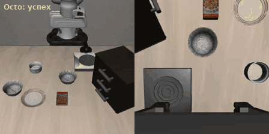
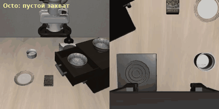
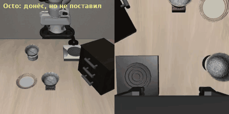
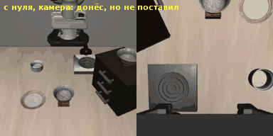
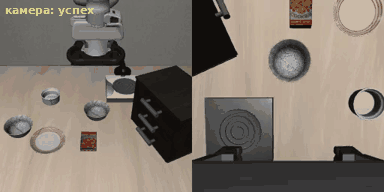
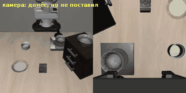
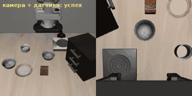
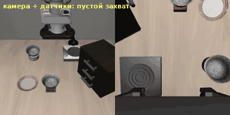
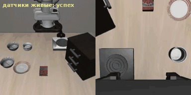
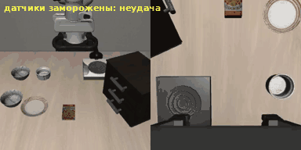

# Глава 3. Octo и FuSe: как научить модель пользоваться датчиками

> Статьи:
> - Octo Model Team (D. Ghosh, H. Walke, K. Pertsch, K. Black, O. Mees и др.), «Octo: An Open-Source Generalist
>   Robot Policy», RSS 2024 — [arXiv:2405.12213](https://arxiv.org/abs/2405.12213).
>   Код: [octo-models/octo](https://github.com/octo-models/octo).
> - J. Jones, O. Mees, C. Sferrazza, K. Stachowicz, P. Abbeel, S. Levine, «Beyond Sight: Finetuning Generalist
>   Robot Policies with Heterogeneous Sensors via Language Grounding» (FuSe), 2025 —
>   [arXiv:2501.04693](https://arxiv.org/abs/2501.04693). Код: [fuse-model/FuSe](https://github.com/fuse-model/FuSe),
>   сайт: [fuse-model.github.io](https://fuse-model.github.io/).

## Введение

Поскольку в главе 2 я понял, что хочу глубже погрузиться в проблему работы модели с датчиками, я решил
изучить статью FuSe, которая строит своё исследование на основе модели Octo. Для этого сначала
познакомился с архитектурой самой Octo.

## 1. Что прочитал

### 1.1. Octo

Статья описывает принцип работы Octo. Авторы обучили свою модель с нуля на данных роботов — 800 тысяч
демонстраций из Open X-Embodiment — и получили хорошие результаты. В отличие от OpenVLA, Octo не
построена на большой языковой модели: это небольшой трансформер (27 млн параметров у Octo-Small и 93 млн
у Octo-Base против 7 млрд у OpenVLA), а готовая языковая модель T5 используется только для того, чтобы
превратить команду в числа. Если вспомнить сравнительные испытания из статьи OpenVLA на реальных
роботах, Octo (там бралась Octo-Base) заметно отстаёт:

| Испытание (статья OpenVLA) | Octo | OpenVLA |
|---|---|---|
| робот WidowX (BridgeData V2), без дообучения, 170 попыток | 20,0% | 70,6% |
| робот Google, без дообучения, 60 попыток | 26,7% | 85,0% |
| робот Franka, дообучение на 10–150 демонстрациях, 7 задач | 43,4% | 67,2% |

Без дообучения Octo часто берёт не тот предмет, особенно когда рядом есть лишние, а иногда просто водит
рукой без цели. После дообучения разрыв меньше, а в задачах с несколькими предметами и разными командами
Octo местами даже лучше: например, «накрыть предмет полотенцем» — 91,7% против 50%. Зато Octo работает
быстрее, весит намного меньше, и дообучить её в наших условиях становится реально.

Основное преимущество Octo — она с самого начала собрана из отдельных блоков. Каждый вход (камера,
команда, датчики) превращается в токены своим маленьким блоком, а действие считывается из отдельных
«readout»-токенов. Поэтому при дообучении можно добавить модели новый «орган чувств» или новый тип
действий, не переучивая её с нуля: дописать блок для нового входа и новую «голову», а основную часть
оставить. По словам авторов, на обычной видеокарте это занимает несколько часов. Они проверили это на
настоящих роботах: добавляли датчик силы-момента для вставки детали, управление углами суставов вместо
движения захвата и двурукого робота ALOHA.

Ещё две вещи, которые были в Octo раньше, чем в OpenVLA-OFT из главы 2: действия выдаются непрерывными
числами (через диффузионную «голову»), и сразу пачкой из нескольких шагов.

Дальше в экспериментах я сравню эту модель с OpenVLA в том же симуляторе на тех же испытаниях.

### 1.2. Почему новый вход — ещё не новое «чувство»

Хотя Octo умеет принимать на входе другие данные, на практике эта способность реализуется не полностью.
Сами авторы Octo в приложении E («Things that did not work (yet)») пишут, что показания суставов на входе
при основном обучении делали модель хуже, и поэтому от них отказались: текущее положение руки сильно
похоже на следующее действие, и модель начинает продолжать движение вместо того, чтобы смотреть на сцену.

Авторы FuSe говорят об этом прямо: если просто дообучить готовую модель с новым датчиком на входе, она
продолжает опираться на то, на чём её учили (на камеру), и игнорирует новые данные. Как раз эту проблему
и решает их метод.

### 1.3. FuSe

Целью работы было научить модель действовать там, где на камеру положиться уже нельзя и нужно опираться
на другие датчики, — например, достать предмет из пакета, когда его не видно. Робот — WidowX (тот же, что
в BridgeData из главы 1), у него на пальцах тактильные датчики DIGIT, есть микрофон и две камеры. Авторы
собрали около 27 тысяч демонстраций с камерами, осязанием, звуком и текстовыми описаниями.

Основной принцип: при дообучении модель учится не только действовать, но и **связывать показания датчиков
со словами**. Для этого у неё два дополнительных задания:
1. сопоставить показания датчиков с текстовым описанием того же момента («мягкий», «мнётся», «играет
   пианино»);
2. самой описать словами то, что она чувствует или слышит.

Язык становится «мостом» между датчиками. Благодаря этому модель справляется с командами, которых не было
в обучении: например, «возьми предмет того же цвета, что кнопка, которая играет пианино» — сначала нужно
по звуку понять, какая это кнопка, а потом по камере найти предмет нужного цвета. А взяв предмет, может
сама сказать: «предмет, который я держу, мягкий и мнётся». По словам авторов, успех выше, чем у всех
сравниваемых вариантов, больше чем на 20%. Тот же подход работает и для Octo, и для большой VLA-модели.

<i>Схема FuSe из статьи авторов: слева — датчики (камеры, осязание, звук), в центре — дообучение
готовой модели (Octo или VLA) с двумя дополнительными заданиями, справа — примеры команд и описаний.
Изображение: fuse-model.github.io. Видео работы робота — на
<a href="https://fuse-model.github.io/static/videos/fuse/final_fuse_video.mp4">сайте проекта</a>.</i>

## 2. Что сделал

### 2.1. План

Всё — в том же симуляторе LIBERO и на тех же 30 попытках LIBERO-Spatial, что в главах 1 и 2.

1. **Базовая Octo.** Для начала хотел просто скачать базовую модель в наш симулятор. Но базовая Octo
   LIBERO никогда не видела: в её обучении нет ни этих сцен, ни этого робота, и у неё нет статистики,
   по которой её ответы переводятся в движения именно этого робота. Поэтому без дообучения запускать её
   нет смысла — насколько ей не хватает LIBERO, видно по попытке 1 в шаге 2.
2. **Уже обученная Octo.** Нашёл Octo, которую уже дообучили на LIBERO, и ожидаю получить то же, что в
   сравнительной таблице статьи OpenVLA для LIBERO: результат чуть хуже, чем у OpenVLA (на LIBERO-Spatial
   у авторов OpenVLA — 78,9% у Octo против 84,7% у OpenVLA).
3. **Своё дообучение с датчиками.** Дообучаю модель распознавать на входе не только кадр камеры, но и
   показания датчиков робота — где находится захват, как он повёрнут и насколько раскрыты пальцы.
   Согласно статье FuSe, результаты не должны измениться: модель будет «лениться» и продолжит опираться
   на камеру, хотя по логике с датчиками результат должен улучшаться. Силу контакта на вход подать нельзя:
   в демонстрациях LIBERO её не записывали.
4. **Метод FuSe.** Дальше — попробовать внедрить метод FuSe и посмотреть, улучшатся ли результаты.

### 2.2. Шаг 1: готовая Octo в LIBERO

Модель получала то же, что OpenVLA в главе 1: **кадр внешней камеры и команду текстом**. Камеры на
запястье и датчиков у неё нет. Отвечает она пачкой из 4 действий (сдвиг и поворот захвата, открыть или
закрыть пальцы); робот выполняет все 4, и модели дают новый кадр.

| Модель | Размер | Входы | Успех (те же 30 попыток) | 95% ДИ | Успешная попытка |
|---|---|---|---|---|---|
| OpenVLA, глава 1 | 7 млрд | внешняя камера | 23/30 (76,7%) | [59%, 88%] | ~103 с |
| OpenVLA-OFT, глава 2 | 7 млрд | 2 камеры + датчики | 30/30 (100%) | [89%, 100%] | ~18 с |
| **Octo** | **27 млн** | внешняя камера | **22/30 (73,3%)** | [56%, 86%] | **~15 с** |

<i>Octo, задача 2 «миска из центра стола». Слева — внешняя камера (её получает модель),
справа — камера на запястье (только для нас).</i>

Модель в 250 раз меньше OpenVLA, с тем же входом справляется почти так же: разница в одну попытку
лежит внутри погрешности. Один запрос к ней занимает 0,15 с против 0,83 с у OpenVLA, и за каждый
запрос робот получает 4 действия вместо одного, поэтому удачная попытка проходит примерно в 7 раз быстрее.
У авторов OpenVLA Octo на LIBERO-Spatial набрала 78,9% — тоже в пределах погрешности от наших 73,3%.

**Неудачи (8 из 30)** — по тем же правилам, что в главах 1 и 2:

| Что произошло | Octo | OpenVLA, глава 1 |
|---|---|---|
| замирание (рука почти не двигается) | 0 | 3 |
| столкновение | 3 | 1 |
| пустой захват (сжал пальцы мимо миски) | 2 | 2 |
| коснулся миски, но не поднял | 2 | — |
| поднял миску, но не поставил | 1 | 1 |

<table>
<tr>
<td align="center"> <i>миска в ящике: захват сжимается над ней, не опускаясь</i></td>
<td align="center"> <i>миска на рамекине: донёс до тарелки, но не отпустил</i></td>
</tr>
</table>

Замираний, как у OpenVLA, нет ни одного: модель отвечает пачками и всё время двигает руку. Зато
ошибки «по высоте» остались: захват сжимается над миской, не опустившись до неё, или держит миску над
краем тарелки и не отпускает. Это как раз то, что могли бы подсказать камера на запястье и датчики, —
их и добавим на шаге 2.

Оговорка: это не модель авторов Octo. Её выложил сторонний исследователь (`cyrusneary/octo-finetuned-libero`)
и обучал сразу на всех четырёх наборах LIBERO, 60 000 шагов.

Ноутбук: [`notebooks/libero_octo_colab.ipynb`](../notebooks/libero_octo_colab.ipynb),
скрипт: [`scripts/libero_octo_eval.py`](../scripts/libero_octo_eval.py).

### 2.3. Шаг 2: дообучение с датчиками и без

**Как учим.** На тех же 432 демонстрациях LIBERO-Spatial, на которых учились OpenVLA и OpenVLA-OFT
(`openvla/modified_libero_rlds`). В каждом шаге демонстрации есть кадр внешней камеры, кадр камеры на
запястье, показания датчиков (положение и поворот захвата, раскрытие пальцев — 8 чисел), действие
человека и команда. Модели показывают вход, она предсказывает действие, его сравнивают с действием
человека и чуть подправляют веса. Варианты отличаются **только тем, какую часть демонстрации видит
модель**; данные, число шагов и настройки одинаковые. На проверке каждая модель получает те же входы,
на которых её учили, — с живыми показаниями из симулятора.

Технически это пример авторов Octo для нового входа (`examples/02_finetune_new_observation_action.py`),
переписанный под LIBERO, — скрипт [`scripts/octo_finetune_libero.py`](../scripts/octo_finetune_libero.py):
- берём готовую модель и её настройки; для датчиков добавляем новый блок `LowdimObsTokenizer`, который
  превращает 8 чисел в токены (каждое число раскладывается на 256 уровней); все остальные веса переносятся
  из готовой модели, новый блок учится с нуля;
- голова действий остаётся прежней: Octo уже выдаёт пачку из 4 действий по 7 чисел — как нужно для LIBERO;
- демонстрации читаются загрузчиком Octo с теми же искажениями картинок, что у авторов (обрезка, яркость,
  контраст); захват переводится в «1 — открыт, 0 — закрыт»;
- 3000 шагов, пачка 32 примера, скорость обучения 1·10⁻⁴ с разгоном и плавным спадом; языковая модель T5
  не дообучается.

Всё запускается из блокнота [`notebooks/libero_octo_finetune_colab.ipynb`](../notebooks/libero_octo_finetune_colab.ipynb):
блоки 1–4 — установка и скачивание демонстраций (~2 ГБ), блок 5 — пробные 200 шагов (замер скорости и
памяти), блок 6 — обучение и сразу проверка каждого варианта на 30 попытках, блок 7 — таблица результатов.
Заморозка датчиков на проверке — флаг `--freeze-proprio` скрипта [`scripts/libero_octo_eval.py`](../scripts/libero_octo_eval.py).

**Ограничение бесплатной T4.** Пачка из 64 примеров со всеми входами не помещается в память, поэтому
пачка 32; скорость ~1,3 шага в секунду, т.е. 3000 шагов — около 40 минут на вариант. Для сравнения: автор
готовой модели из шага 1 учил 60 000 шагов пачками по 256 — в 160 раз больше примеров.

**Попытка 1: от исходной Octo-Small 1.5 (LIBERO не видела).** Вариант «только камера», 3000 шагов —
**0/30**. Робот при этом не стоит: за попытку проходит 1–2,5 м, сжимает захват, иногда касается миски
и даже поднимает её на 12 см, но ни разу не доносит до тарелки. То есть конвейер работает, а модели не
хватает обучения: с нуля освоить LIBERO за 40 минут на T4 не получается. Сравнивать датчики на моделях,
которые не справляются ни разу, бессмысленно, поэтому вариант с датчиками от исходной Octo я не доучивал.

<i>Попытка 1 (Octo, LIBERO не видевшая, + 3000 шагов): миска на коробке печенья — робот её
поднимает, но до тарелки так и не доносит. Чему-то модель научилась, но точности не хватает.</i>

**Попытка 2: от Octo из шага 1** (уже 60 000 шагов на LIBERO, только камера, 22/30). Обе модели получают
одинаковые дополнительные 3000 шагов на LIBERO-Spatial; разница — только датчики на входе:

| Вариант | Старт | Входы на проверке | Успех (те же 30 попыток) | 95% ДИ |
|---|---|---|---|---|
| Octo из шага 1 (для сравнения) | — | внешняя камера | 22/30 (73,3%) | [56%, 86%] |
| `lib_cam` | Octo из шага 1 | внешняя камера | 22/30 (73,3%) | [56%, 86%] |
| `lib_cam_proprio` | Octo из шага 1 | внешняя камера + датчики | 20/30 (66,7%) | [49%, 81%] |
| `lib_cam_proprio`, датчики **заморожены** | Octo из шага 1 | внешняя камера + датчики с первого шага | 20/30 (66,7%) | [49%, 81%] |

**Зачем замораживать датчики.** Сам по себе результат 20/30 не отвечает на главный вопрос: пользуется ли
модель датчиками вообще. Она могла научиться на них опираться, а могла продолжать работать по одной
камере, просто «получая» лишние числа. Чтобы это различить, я проверяю ту же обученную модель ещё раз, но
подаю ей показания датчиков не живые, а с первого шага попытки — как будто датчик завис: рука уже
двигается, а числа на входе всё время одни и те же. Если модель на датчики опирается, она собьётся, и
успех упадёт (так было в главе 2: у OpenVLA-OFT с 30/30 до 2/30). Если успех не изменится — модель их
фактически не использует. Переобучать для этого ничего не нужно: меняется только то, что подаётся на вход
при проверке.

Обучение и проверка — на L4 в Colab Pro (бесплатная T4 к этому моменту исчерпала лимит): ~4,5 шага
обучения в секунду против ~1,3 на T4, 3000 шагов — около 11 минут на вариант. Настройки те же, что на T4.

**Что получилось.**
- Дополнительные 3000 шагов сами по себе ничего не изменили: `lib_cam` — те же 22/30, что у модели из шага 1.
- С датчиками на входе — 20/30. Разница в две попытки лежит внутри погрешности: сказать, что датчики
  помешали, нельзя. Но и не помогли.
- Главное — заморозка. Если датчики «зависают» на первом шаге попытки, движения меняются: число шагов
  совпало только в 9 попытках из 30, а исход поменялся в 6 — три раза в лучшую сторону и три раза в
  худшую. Но итог ровно тот же — 20/30. То есть модель на датчики **реагирует, но выполнить задачу они ей
  не помогают**: для неё это скорее шум, чем полезная информация.

| Что произошло в неудачах | `lib_cam` (камера) | `lib_cam_proprio` (+ датчики) | датчики заморожены |
|---|---|---|---|
| поднял миску, но не поставил | 4 | 2 | 2 |
| пустой захват (сжал пальцы мимо миски) | 1 | 5 | 5 |
| коснулся миски, но не поднял | 1 | 1 | 2 |
| столкновение | 2 | 2 | 1 |

<table>
<tr>
<td align="center"> <i>только камера, задача 2: успех</i></td>
<td align="center"> <i>только камера, миска на шкафу: донёс до тарелки, но не отпустил</i></td>
</tr>
<tr>
<td align="center"> <i>камера + датчики, задача 2: успех</i></td>
<td align="center"> <i>камера + датчики, миска на рамекине: сжимает захват рядом с миской, не задев её</i></td>
</tr>
<tr>
<td align="center"> <i>камера + датчики, миска рядом с тарелкой, датчики живые: успех</i></td>
<td align="center"> <i>та же модель и та же расстановка, датчики заморожены: коснулся миски, но не поднял</i></td>
</tr>
</table>

С датчиками стало больше «пустых захватов» и меньше случаев «поднял, но не поставил», но при восьми–десяти
неудачах на вариант это может быть и случайностью. Последняя пара показывает, что датчики всё-таки меняют
поведение: с одной и той же расстановки модель с живыми и замороженными датчиками действует по-разному.
Но в сумме по 30 попыткам выигрыша нет.

**Сравнение с главой 2.** У OpenVLA-OFT, которую с самого начала учили с датчиками, заморозка датчиков
роняла успех с 30/30 до 2/30 — модель на них полностью опиралась. Здесь всё наоборот: модель, 60 000 шагов
учившаяся без датчиков, за короткое дообучение так и не начала на них опираться. Это ровно то, о чём
предупреждает FuSe: если просто подать новый датчик на вход, модель может продолжать работать по камере
и почти его не замечать. Чтобы она им пользовалась, нужно либо учить с ним с самого начала (как OFT), либо
специально заставлять (дополнительные задания в FuSe).

Оговорки: 30 попыток на вариант, один запуск обучения на вариант, 3000 шагов дообучения (у автора
исходной модели — 60 000).

Журналы обучения: [`results/octo_finetune_libero_spatial/train_logs/`](../results/octo_finetune_libero_spatial/train_logs/),
результаты по шагам: [`results/octo_finetune_libero_spatial/`](../results/octo_finetune_libero_spatial/).

Ноутбук: [`notebooks/libero_octo_finetune_colab.ipynb`](../notebooks/libero_octo_finetune_colab.ipynb),
скрипт обучения: [`scripts/octo_finetune_libero.py`](../scripts/octo_finetune_libero.py).

### 2.4. Опыт с коробкой печенья

Ту же команду, что в главах 1 и 2, — «pick up the cookie box and place it on the plate», сцена 2 — я дал
трём моделям: Octo из шага 1, `lib_cam` и `lib_cam_proprio`. Успех засчитывается, если коробка `cookies_1`
окажется на тарелке `plate_1`.

| Модель | Успех | Коробка печенья | Миска | Ближе всего к коробке / к миске | Сжатий захвата впустую |
|---|---|---|---|---|---|
| Octo из шага 1 | 0/1 | не тронута (0 Н) | не тронута | 12 см / 8 см | 52 |
| `lib_cam` | 0/1 | не тронута (0 Н) | не тронута | 9 см / 7 см | 49 |
| `lib_cam_proprio` | 0/1 | не тронута (0 Н) | не тронута | 12 см / 8 см | 70 |

Все три модели ведут себя одинаково: рука уходит в сторону миски и тарелки, опускается почти до уровня
тарелки, десятки раз сжимает пальцы в пустоте и заканчивает попытку возле тарелки. Коробку печенья не
трогает ни одна. То есть модель тянется к привычному месту, но без «своей» команды не берёт даже миску.

Сравнение с главами 1 и 2: OpenVLA тоже тянулась к миске, но не смогла её поднять; OpenVLA-OFT
проигнорировала команду и уверенно поставила миску на тарелку. Ни одна из моделей не выполнила новую
команду: все они умеют только то, чему их учили на демонстрациях LIBERO-Spatial, — и датчики на входе
этого не меняют.

### 2.5. Шаг 3: метод FuSe — план

Внедрить FuSe целиком я не успел. Их готовую модель в LIBERO не проверить: она ждёт тактильные датчики DIGIT
и звук, а в LIBERO их нет, и обучена она на другом роботе. Но идею можно перенести:
1. **«Осязание» из симулятора.** MuJoCo считает силу контакта пальцев с каждым предметом — мой скрипт уже
   записывает её на каждом шаге (столбцы `force_*` в таблицах глав 2 и 3). Для обучения нужно заново
   проиграть демонстрации LIBERO в симуляторе и записать эту силу.
2. **Подписи без ручной разметки.** По состоянию симулятора автоматически составлять текст: «захват
   касается миски», «миска в захвате», «пальцы сжаты впустую», «миска на тарелке».
3. **Два дополнительных задания, как в FuSe:** сопоставлять силу контакта и картинку с подписью и
   генерировать подпись по ним.
4. **Сравнение** с `lib_cam_proprio` на тех же 30 попытках: начнёт ли модель опираться на новый вход
   (проверка — та же заморозка) и исчезнут ли «пустые захваты» и «коснулся, но не поднял».

## 3. Впечатления и идеи

### 3.1. Впечатления от статей

Мне нравится, что здесь нет правильного ответа, какой метод использовать. Мы находимся на перекрёстке,
где каждая из дорог даёт свои результаты: OpenVLA-OFT с датчиками с самого начала опирается на них
полностью, Octo с датчиками, добавленными позже, их почти не замечает, а FuSe предлагает специально
заставлять модель ими пользоваться. Хотелось бы протестировать эти алгоритмы на реальном железе.

### 3.2. Гипотеза: разделить «мозг» робота

Больше всего моё внимание привлекло другое, и из этого родилась гипотеза: что если разделить «мозг»
робота? Одну часть использовать для положения и ориентации руки, а вторую — для управления захватом и
получения сигналов от него. Возможно, так мы сможем, во-первых, понимать, когда предмет выпадает из руки:
в симуляции мы это иногда видим и никак не решаем — в неудачах «поднял, но не поставил» и «коснулся, но не
поднял». И, возможно, этот подход даст ещё преимущества, которых я сейчас не вижу.

Сейчас у всех трёх моделей захват — просто одно из семи чисел действия, которое считается вместе с
движением руки. А упрощённый FuSe из этой главы показал, что по внутреннему представлению модели состояние
захвата («держит миску», «сжат впустую») распознаётся почти без ошибок — то есть материал для такой
«второй части мозга» у модели уже есть.

### 3.3. Дальше

В следующей главе попробую посмотреть, существуют ли готовые решения с таким разделением.
