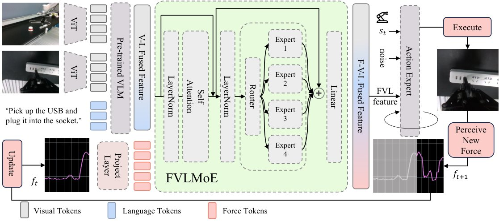
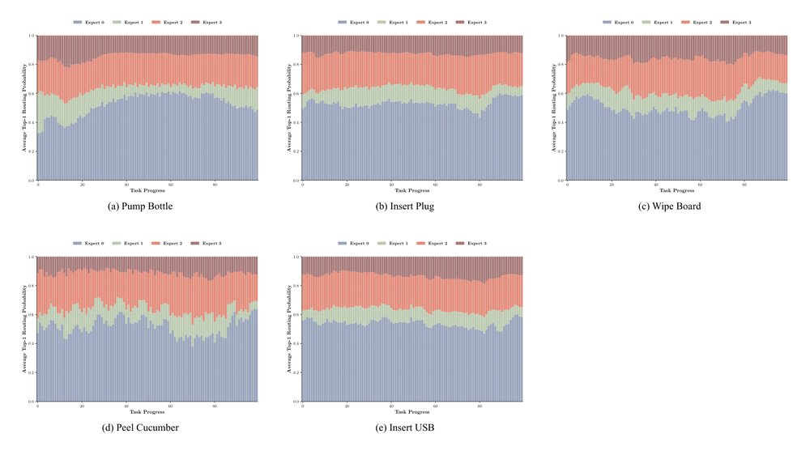
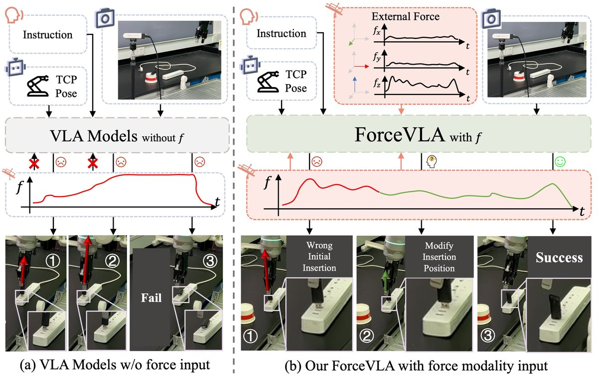
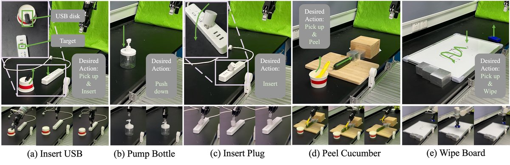

# Глава 4. ForceVLA: сила как отдельный «эксперт»

> Статья: J. Yu, H. Liu, Q. Yu, J. Ren, C. Hao, H. Ding, G. Huang, G. Huang, Y. Song, P. Cai, C. Lu, W. Zhang,
> «ForceVLA: Enhancing VLA Models with a Force-aware MoE for Contact-rich Manipulation», NeurIPS 2025 —
> [arXiv:2505.22159](https://arxiv.org/abs/2505.22159), [сайт проекта](https://sites.google.com/view/forcevla2025).
> Код: [ft-robotic/ForceVLA](https://github.com/ft-robotic/ForceVLA) (форк openpi), данные:
> [qiaojunyu/ForceVLA-real-data](https://huggingface.co/datasets/qiaojunyu/ForceVLA-real-data).
> Рисунки в этой главе — из статьи авторов (HTML-версия на arXiv).

## Введение

Статья, которую я разберу здесь, наконец-то породила во мне множество вопросов, гипотез и предположений о
том, как вообще можно улучшить это направление. Начну с разбора статьи.

## 1. Что прочитал

### 1.1. Главная идея

Статья отвечает на вопрос, который я поставил в гипотезе об отдельной «голове» для захвата (глава 3,
раздел 3.2), только вместо одной отдельной головы авторы предлагают несколько **экспертов** и **судью**,
который в зависимости от ситуации решает, кому дать слово. В основе — модель π0: детально я её не
разбираю, потому что принцип работы VLA мы разобрали в главах 1 и 2. π0 работает всё время — смотрит на
камеры, читает команду и выдаёт движения. А рядом с ней стоит новый блок **FVLMoE**: в него вместе с тем,
что «поняла» π0, приходят показания силы, и судья (router) раздаёт каждый кусочек входа — части картинки,
слова, силу — одному из четырёх небольших экспертов. То, что выдали эксперты, добавляется к π0 как
подсказка при выборе следующего движения. Когда робот просто двигается, подсказка мало что меняет; когда
он упирается в препятствие и сила растёт, она начинает влиять на движение.

Авторы нашли ту же проблему, что и авторы FuSe: модель, обученная в основном на картинках, «ленится»
использовать новые данные. Только решают её иначе — не дополнительными заданиями, а отдельным блоком,
куда сила приходит уже после того, как π0 обработала картинку и текст.

<i>Схема ForceVLA из статьи: камеры и команда проходят через π0 (Pre-trained VLM), сила — через свой
линейный слой (Project Layer); вместе они попадают в FVLMoE (внимание, судья, 4 эксперта), а результат идёт в часть
π0, которая генерирует действия (Action Expert).</i>

### 1.2. Подробности

**Откуда берётся сила.** Это не датчик в руке робота. Робот Flexiv Rizon сам **оценивает** внешнюю силу,
приложенную к концу инструмента, — 3 силы и 3 момента, в системе координат основания. В документации SDK
Flexiv эта величина (`ext_wrench_in_world`) прямо названа «оценённой» и отделена от показаний отдельного
датчика силы во фланце (`ft_sensor_raw`, «равно 0, если датчик не установлен»); в датасете она записана как
`f_ext_base_frame`. В каждом суставе Rizon стоит датчик момента, так что, судя по всему, оценка считается по
ним. Сами авторы в ограничениях пишут, что пользуются именно оценкой, а не прямым измерением.

**Как сила попадает в модель.** Шесть чисел текущей силы превращаются одним линейным слоем в **один
токен**; истории силы модель не видит. Этот токен дописывается к выходу π0 и идёт в FVLMoE: слой внимания,
затем «смесь экспертов» — 4 эксперта, каждый токен судья отправляет ровно к одному из них. Модель выдаёт
целевую позу захвата и ширину пальцев; режима податливого управления (импеданса) в статье и коде нет — сила
для модели лишь ещё одно наблюдение.

**Где добавлять силу — важно.** Авторы проверили разные места (таблица 3; судя по цифрам — на задаче со вставкой вилки):

| Куда добавлена сила | Успех |
|---|---|
| никуда (π0) | 45% |
| до π0, линейным слоем | 55% |
| до π0, через смесь экспертов | **0%** |
| после π0, просто дописана к выходу | 60% |
| после π0, через FVLMoE (ForceVLA) | **80%** |

Если менять вход уже обученной π0, она «сбивается» и разучивается понимать картинку — смесь экспертов до π0
провалилась полностью. Поэтому силу добавляют после.

**Простое добавление силы почти не помогает.** Если просто дописать силу к показаниям датчиков робота
(«π0 w/ F» — ровно то, что мы делали с Octo в главе 3), средний успех растёт лишь с 37,3% до 40,2%, а у
π0-FAST даже падает — с 31,0% до 14,2%. ForceVLA — 60,5%:

| Задача | π0 без силы | π0 + сила на входе | ForceVLA |
|---|---|---|---|
| вставить USB | 5% | 5% | 25% |
| вставить вилку в розетку | 45% | 60% | 80% |
| нажать на дозатор бутылки | 33% | 83% | 67% |
| протереть доску (вариант 1) | 45% | 0% | 64% |
| протереть доску (вариант 2) | 9% | 0% | 27% |
| почистить огурец | 87% | 93% | 100% |
| **в среднем** | **37,3%** | **40,2%** | **60,5%** |

На огурце авторы мерили и качество: средняя длина снятой полоски 14,1 см против 10,3 см у π0 без силы, и
чистый огурец за 7 движений против 14.

**Проверка на изменённых условиях** (другие бутылки и вилки, другая высота розетки, частично закрытая
камера, шатающаяся розетка): ForceVLA в среднем 63,8% против 38,9% у π0 без силы. Сильнее всего разница при
закрытой камере — 90% против 60%: когда картинке нельзя доверять, сила помогает больше всего. А π0 с силой,
просто добавленной на вход, в среднем даже хуже, чем без неё (32,0%).

**Что делают эксперты.** Авторы посмотрели, к какому эксперту судья отправляет токены на разных этапах
задачи. Эксперт 0 занят почти всё время, а доли остальных меняются по ходу движения — например, при
нажатии на дозатор. То есть «эксперт по силе» заранее не назначен: специализация появляется сама, но
выражена не очень резко.

<i>Из статьи: доля токенов, которые судья отправляет к каждому из 4 экспертов, по ходу выполнения
задачи (по горизонтали — прогресс от 0 до 100%).</i>

**Данные и обучение.** 244 демонстрации на 5 задач (около 50 на задачу), записаны людьми через очки
виртуальной реальности Quest 3 на роботе Flexiv Rizon; две камеры (внешняя и на запястье) и сила — 30 раз в
секунду. Обучение одной задачи — 10 000 шагов, около 9 часов на одной RTX 4090; проверка — 10–20 попыток на
задачу.

**Скорость.** Частота управления и время ответа модели в статье не указаны. У самой π0, по её статье, один
ответ занимает 73 мс на RTX 4090; модель выдаёт пачку из 50 действий, а новую картинку и силу получает
раз в 0,5–0,8 с. Контроллер Flexiv при этом выдаёт силу 1000 раз в секунду.

## 2. Практика

Повторить этот опыт в нашем симуляторе не получается. Готовых обученных моделей ForceVLA нет — выложены
только код обучения и данные, а всё обучение и все проверки шли на настоящем роботе Flexiv. В LIBERO нет
демонстраций с силой и нет задач, где сила по-настоящему нужна (взять миску и поставить её на тарелку можно
и по картинке).

| Что есть | Состояние |
|---|---|
| код обучения | есть, [ft-robotic/ForceVLA](https://github.com/ft-robotic/ForceVLA), форк openpi на JAX |
| данные | есть, 5 задач на Flexiv, у каждой копия без силы (`_noForce`) для сравнения |
| обученные модели | нет |
| симулятор | нет; код сбора данных и запуска на роботе тоже пока не выложен |
| видеопамять для обучения (LoRA) | больше 22,5 ГБ |

Чтобы проверить ForceVLA в симуляторе, понадобилось бы: заново записать демонстрации с силой (в MuJoCo её
можно получить), взять задачу, где без силы не обойтись (например, вставить штырь в отверстие), и дообучить
π0 с силой и без неё — по их настройкам это много часов на сильной видеокарте для каждого варианта.

## 3. Впечатления

Мне понравилось, что авторы статьи решают необычные сложные задачи, как на рисунке ниже, где робот
вставляет вилку в розетку.

<i>Рис. 1 из статьи: без силы (слева) модель не замечает, что вилка вошла криво, и задача
проваливается; ForceVLA (справа) по силе понимает, что начальная вставка неверная, поправляет положение и
вставляет вилку.</i>

<i>Рис. 4 из статьи: вставить USB, нажать на дозатор, вставить вилку, почистить огурец, протереть доску.</i>

Но мне показалось, что метод не был проверен на больших общих тестах, где сравнивают конкурирующие модели,
которые мы разбирали раньше. Это действительно так: проверка — только на пяти своих задачах на одном роботе,
по 10–20 попыток на задачу, а сравнение — только с вариантами π0 и π0-FAST, без OpenVLA, Octo, OFT и без
общих тестов вроде LIBERO. То есть да, мы дали роботу новые данные, и он показал результат лучше, но что это
означает для нас? Можно ли использовать уже подготовленные наборы данных, или нужно готовить все новые?
Насколько я понимаю, это не самая простая задача: в известных наборах (LIBERO, BridgeData, Open X-Embodiment)
силы нет, а у авторов сила — это оценка конкретного робота Flexiv, которую на другом роботе придётся
получать заново.

Также я не очень понял, каким образом решена проблема того, как именно робот возьмёт в руки, например,
овощечистку, — это ведь тоже на многое влияет. В статье у этой задачи подпись «взять и почистить», то есть
робот сам берёт овощечистку, но отдельно о том, как обеспечивается правильный хват, не сказано: он
выучивается из примерно 50 демонстраций вместе со всем остальным.

Все свои вопросы для обсуждения и гипотезы я перенесу в заключительную главу 5 — подведение итогов.
